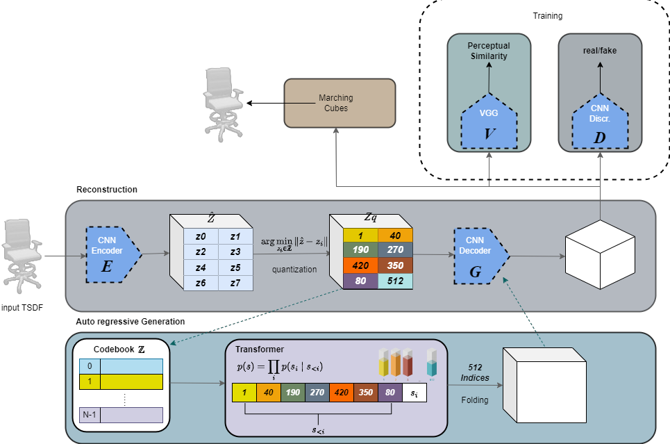
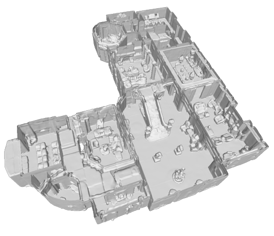
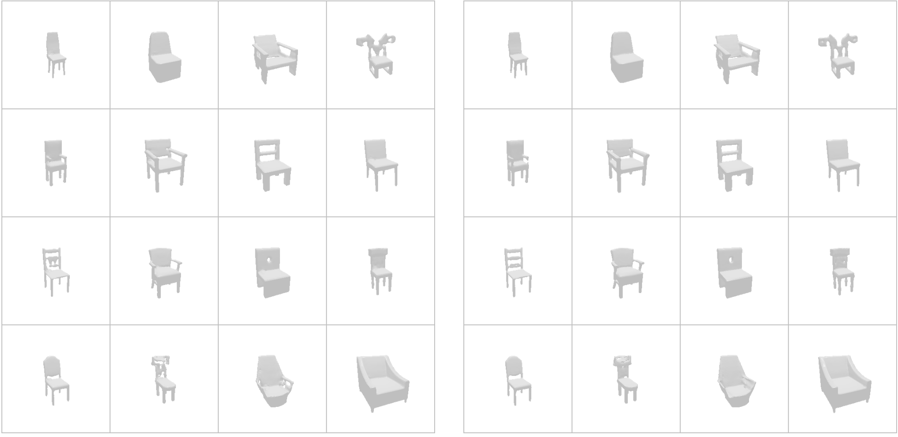

# VQGAN 3D Scene Reconstruction

> Learning compact discrete latent representations of 3D shapes using VQVAE variants with autoregressive transformer-based generation.

**[Project Website](https://d1nds4el9kv5qg.cloudfront.net/)**

Built as part of the **3D AI Lab — Scene Reconstruction Praktikum (SS24)** at TUM, supervised by Prof. Dr. Angela Dai.



## Overview

This project implements a full pipeline for **3D shape reconstruction and generation** using vector-quantized variational autoencoders (VQ-VAE). The pipeline operates in two stages:

1. **Reconstruction** — A VQVAE model learns a compact discrete latent representation of 3D shapes from Truncated Signed Distance Fields (TSDFs). Each shape is encoded as a sequence of discrete codebook indices.
2. **Generation** — An autoregressive transformer is trained on the codebook index sequences to generate novel 3D shapes. The predicted sequences are decoded through the VQVAE decoder to produce the final 3D output.

### Scene Reconstruction



### Dense Reconstruction — Chairs



## Models

| Model | Description |
|-------|-------------|
| **VQVAE** | Base vector-quantized VAE for 3D shape reconstruction from input TSDFs |
| **PVQVAE** | Patched VQVAE — each spatial patch is encoded independently for finer-grained representations |
| **VQVAE + Perceptual Loss** | VQVAE augmented with a 3D VGG perceptual loss for improved reconstruction quality |
| **VQGAN** | Full adversarial setup — perceptual loss VQVAE trained with an additional discriminator |
| **Autoregressive Transformer** | Generates codebook index sequences for unconditional 3D shape generation |
| **VAE** | Standard 3D variational autoencoder baseline |

## Project Structure

```
src/
├── blocks/          # Network building blocks (encoder, decoder, quantizer, attention, transformer)
├── configs/         # YAML configuration files
├── datasets/        # ShapeNet dataset loaders (voxels, SDF, point clouds)
├── losses/          # Loss functions (L1, VQ, LPIPS, Dice, KL divergence)
├── metrics/         # Evaluation metrics (IoU, Chamfer Distance)
├── models/          # Model definitions (AutoEncoder, PVQVAE, GlobalPVQVAE, VAE, Transformer)
├── training/        # Training loop, logging, visualization
├── pre_processing/  # Codebook index extraction utilities
└── utils/           # Visualization, 3D rendering, and helper functions
```

## Dataset

The project uses the [ShapeNet](https://shapenet.org/) dataset. Multiple data representations are supported:
- **ShapeNetCore.v2** — Signed Distance Fields (SDF)
- **ShapeNetVox32** — 32³ voxelized models
- **ShapeNetPointClouds** — Point cloud representations

## Installation

```bash
git clone https://github.com/<your-username>/3DPerception.git
cd 3DPerception
pip install -r requirements.txt
```

### Key Dependencies

- PyTorch 2.2
- PyTorch3D (for mesh rendering)
- einops, omegaconf, tensorboard
- trimesh, open3d, k3d (3D visualization)

## Usage

### Training

Configure the model and training parameters in `src/configs/global_configs.yaml`, then:

```python
# In a notebook or script
from src.training.ModelTrainer import ModelTrainer
from src.datasets.shape_net.shape_net_v2_sdf import ShapeNetV2SDF

trainer = ModelTrainer(dataset_type=ShapeNetV2SDF)
trainer.train()
```

Or use the provided notebooks:
- **`Train.ipynb`** — Main training notebook
- **`ModelEval.ipynb`** — Model evaluation and visualization
- **`EvaluateCodeBook.ipynb`** — Codebook utilization analysis
- **`demo_model.ipynb`** — Demo inference

### Configuration

All hyperparameters are managed through `src/configs/global_configs.yaml`. Key settings:
- `model.model_field` — Select model variant (`globalPVQVAE`, `pvqvae`, `auto_encoder`, `vae3d`, `decoder_transformer`)
- `dataset.dataset_field` — Select data format (`shape_net_v2_sdf`, `shape_net_v3_sdf`, `shape_net_vox`)
- Training schedule, learning rates, and loss weights are all configurable

## Authors

- **Mino Estrella** — mino.estrella@tum.de
- **Youssef Youssef** — youssef.youssef@tum.de
